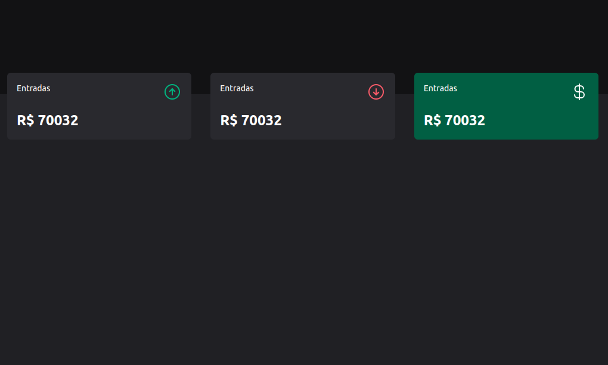

# Projeto de Três Cards

Este é um projeto simples que consiste em três cards.

**Título do Card**

Descrição do Card. Pode ser um resumo do conteúdo que o card representa.

## Tecnologias Utilizadas

- HTML 5
- Tailwind css

## Contribuição

Contribuições são bem-vindas! Sinta-se à vontade para abrir um pull request.

## Licença

Este projeto está licenciado sob a [Licença MIT](LICENSE).